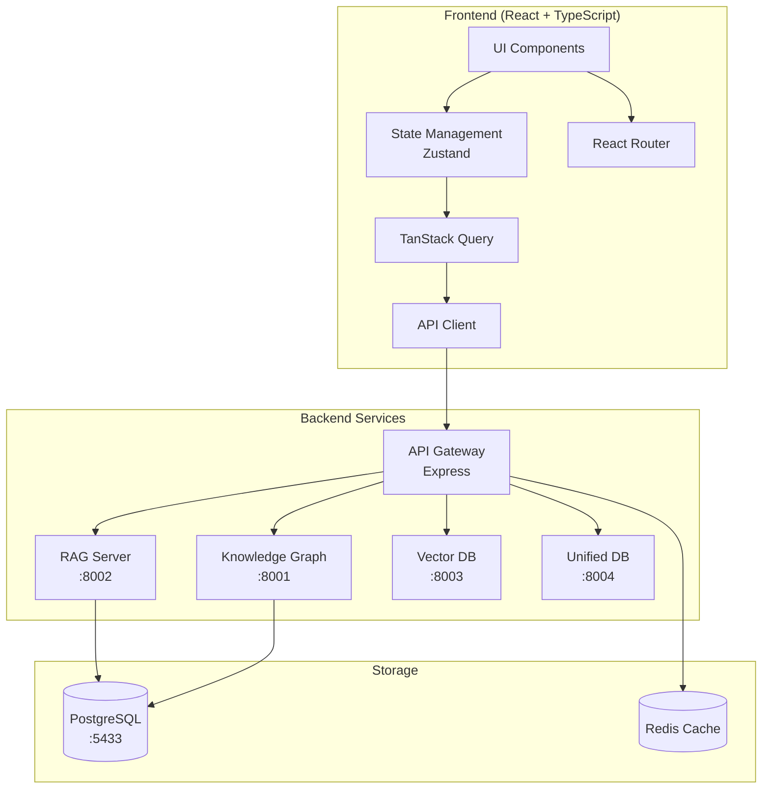
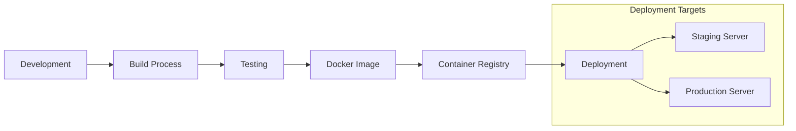

# Knowledge RAG Web UI - Architecture

## Overview

The Knowledge RAG Web UI is a modern React application that provides a user-friendly interface for the Knowledge RAG System. It follows a feature-based architecture with clear separation of concerns.

## System Architecture



## Frontend Architecture

### Directory Structure
```
src/
├── components/              # Reusable UI components
│   ├── common/             # Generic components (Button, Input, etc.)
│   │   ├── Button/
│   │   ├── Input/
│   │   └── Card/
│   ├── memories/           # Memory-specific components
│   │   ├── MemoryCard/
│   │   ├── MemoryList/
│   │   └── MemoryEditor/
│   ├── search/             # Search components
│   │   ├── SearchBar/
│   │   └── SearchResults/
│   └── layout/             # Layout components
│       ├── Header/
│       ├── Sidebar/
│       └── Layout/
│
├── features/               # Feature modules (co-located logic)
│   ├── auth/              # Authentication feature
│   │   ├── components/
│   │   ├── hooks/
│   │   ├── services/
│   │   └── types/
│   ├── memories/          # Memory management
│   │   ├── components/
│   │   ├── hooks/
│   │   ├── services/
│   │   └── types/
│   ├── search/            # Search feature
│   │   ├── components/
│   │   ├── hooks/
│   │   ├── services/
│   │   └── types/
│   └── collections/       # Collections feature
│       ├── components/
│       ├── hooks/
│       ├── services/
│       └── types/
│
├── hooks/                  # Global custom hooks
│   ├── useDebounce.ts
│   ├── useLocalStorage.ts
│   └── useKeyboardShortcuts.ts
│
├── services/               # API and external services
│   ├── api/               # API client configuration
│   │   ├── client.ts
│   │   └── endpoints.ts
│   ├── rag/               # RAG service integration
│   └── websocket/         # WebSocket client
│
├── stores/                 # Zustand state stores
│   ├── authStore.ts       # Authentication state
│   ├── memoryStore.ts     # Memory state
│   ├── searchStore.ts     # Search state
│   └── uiStore.ts         # UI preferences
│
├── utils/                  # Utility functions
│   ├── formatters.ts      # Data formatting
│   ├── validators.ts      # Input validation
│   └── constants.ts       # App constants
│
├── types/                  # TypeScript type definitions
│   ├── api.ts             # API response types
│   ├── models.ts          # Data models
│   └── components.ts      # Component prop types
│
├── styles/                 # Global styles
│   ├── globals.css        # Global CSS
│   └── themes.css         # Theme variables
│
└── App.tsx                # Root component
```

### Component Architecture

#### Component Types

1. **Presentational Components**
   - Pure UI components
   - No direct state management
   - Receive props and emit events
   ```typescript
   interface ButtonProps {
     variant: 'primary' | 'secondary';
     onClick: () => void;
     children: React.ReactNode;
   }
   ```

2. **Container Components**
   - Connect to state stores
   - Handle business logic
   - Pass data to presentational components
   ```typescript
   const MemoryListContainer = () => {
     const memories = useMemoryStore(state => state.memories);
     const fetchMemories = useMemoryStore(state => state.fetchMemories);
     
     return <MemoryList memories={memories} onRefresh={fetchMemories} />;
   };
   ```

3. **Feature Components**
   - Complete feature modules
   - Self-contained with own state
   - Can be lazy-loaded
   ```typescript
   const SearchFeature = lazy(() => import('@/features/search'));
   ```

### State Management

#### Zustand Store Pattern
```typescript
interface MemoryStore {
  // State
  memories: Memory[];
  loading: boolean;
  error: string | null;
  
  // Actions
  fetchMemories: () => Promise<void>;
  createMemory: (memory: CreateMemoryDto) => Promise<void>;
  updateMemory: (id: string, updates: Partial<Memory>) => Promise<void>;
  deleteMemory: (id: string) => Promise<void>;
  
  // Computed
  getMemoryById: (id: string) => Memory | undefined;
}
```

#### State Organization
- **Auth Store**: User authentication and session
- **Memory Store**: Memory data and operations
- **Search Store**: Search state and history
- **UI Store**: Theme, preferences, layout

### Data Flow

```
User Action → Component → Hook → Store Action → API Call → Store Update → Component Re-render
```

Example:
```typescript
// 1. User clicks search
<SearchBar onSearch={handleSearch} />

// 2. Component calls hook
const { search, results } = useSearch();

// 3. Hook calls store action
const handleSearch = (query: string) => {
  search(query);
};

// 4. Store makes API call
const search = async (query: string) => {
  const results = await ragApi.search(query);
  set({ results });
};

// 5. Component re-renders with results
{results.map(result => <SearchResult key={result.id} {...result} />)}
```

### API Integration

#### API Client Structure
```typescript
class RAGApiClient {
  private baseUrl: string;
  private headers: Headers;
  
  constructor(config: ApiConfig) {
    this.baseUrl = config.baseUrl;
    this.headers = new Headers({
      'Content-Type': 'application/json',
      'Authorization': `Bearer ${config.token}`
    });
  }
  
  async request<T>(endpoint: string, options?: RequestInit): Promise<T> {
    const response = await fetch(`${this.baseUrl}${endpoint}`, {
      ...options,
      headers: this.headers
    });
    
    if (!response.ok) {
      throw new ApiError(response.status, await response.text());
    }
    
    return response.json();
  }
}
```

#### React Query Integration
```typescript
// Query for fetching data
export const useMemories = () => {
  return useQuery({
    queryKey: ['memories'],
    queryFn: () => ragApi.getMemories(),
    staleTime: 5 * 60 * 1000, // 5 minutes
  });
};

// Mutation for updating data
export const useCreateMemory = () => {
  const queryClient = useQueryClient();
  
  return useMutation({
    mutationFn: (memory: CreateMemoryDto) => ragApi.createMemory(memory),
    onSuccess: () => {
      queryClient.invalidateQueries({ queryKey: ['memories'] });
    },
  });
};
```

### Routing Strategy

```typescript
const router = createBrowserRouter([
  {
    path: '/',
    element: <Layout />,
    children: [
      {
        index: true,
        element: <MemoriesPage />,
      },
      {
        path: 'search',
        element: <SearchPage />,
      },
      {
        path: 'collections',
        element: <CollectionsPage />,
      },
      {
        path: 'graph',
        element: <KnowledgeGraphPage />,
      },
      {
        path: 'settings',
        element: <SettingsPage />,
      },
    ],
  },
  {
    path: '/auth',
    element: <AuthLayout />,
    children: [
      {
        path: 'login',
        element: <LoginPage />,
      },
      {
        path: 'register',
        element: <RegisterPage />,
      },
    ],
  },
]);
```

### Performance Optimization

#### Code Splitting
```typescript
// Route-based splitting
const KnowledgeGraph = lazy(() => import('@/features/graph'));

// Component-based splitting
const HeavyComponent = lazy(() => import('@/components/HeavyComponent'));
```

#### Memoization
```typescript
// Memo for expensive components
const ExpensiveComponent = memo(({ data }) => {
  return <ComplexVisualization data={data} />;
});

// useMemo for expensive computations
const filteredMemories = useMemo(
  () => memories.filter(m => m.collection === selectedCollection),
  [memories, selectedCollection]
);
```

#### Virtual Scrolling
```typescript
import { VirtualList } from '@tanstack/react-virtual';

const MemoryList = ({ memories }) => {
  const parentRef = useRef<HTMLDivElement>(null);
  
  const virtualizer = useVirtualizer({
    count: memories.length,
    getScrollElement: () => parentRef.current,
    estimateSize: () => 120,
  });
  
  return (
    <div ref={parentRef} className="h-full overflow-auto">
      <div style={{ height: `${virtualizer.getTotalSize()}px` }}>
        {virtualizer.getVirtualItems().map(virtualItem => (
          <MemoryCard
            key={virtualItem.key}
            memory={memories[virtualItem.index]}
            style={{
              transform: `translateY(${virtualItem.start}px)`,
            }}
          />
        ))}
      </div>
    </div>
  );
};
```

### Security Considerations

#### Authentication Flow
```typescript
// Auth guard component
const ProtectedRoute = ({ children }: { children: ReactNode }) => {
  const isAuthenticated = useAuthStore(state => state.isAuthenticated);
  const location = useLocation();
  
  if (!isAuthenticated) {
    return <Navigate to="/auth/login" state={{ from: location }} replace />;
  }
  
  return <>{children}</>;
};
```

#### API Security
- JWT token in Authorization header
- Refresh token rotation
- CSRF protection
- XSS prevention via React's built-in escaping

### Testing Strategy

#### Unit Tests
```typescript
describe('MemoryCard', () => {
  it('renders memory content', () => {
    const memory = { id: '1', title: 'Test', content: 'Content' };
    render(<MemoryCard memory={memory} />);
    expect(screen.getByText('Test')).toBeInTheDocument();
  });
});
```

#### Integration Tests
```typescript
describe('Memory Management', () => {
  it('creates and displays new memory', async () => {
    render(<App />);
    
    await userEvent.click(screen.getByText('New Memory'));
    await userEvent.type(screen.getByLabelText('Title'), 'Test Memory');
    await userEvent.click(screen.getByText('Save'));
    
    await waitFor(() => {
      expect(screen.getByText('Test Memory')).toBeInTheDocument();
    });
  });
});
```

#### E2E Tests
```typescript
test('complete memory workflow', async ({ page }) => {
  await page.goto('/');
  await page.click('text=New Memory');
  await page.fill('[name=title]', 'E2E Test Memory');
  await page.fill('[name=content]', 'This is a test');
  await page.click('text=Save');
  
  await expect(page.locator('text=E2E Test Memory')).toBeVisible();
});
```

### Deployment Architecture



### Monitoring and Analytics

- Performance monitoring with Web Vitals
- Error tracking with Sentry
- User analytics with privacy-focused solution
- API response time tracking

### Scalability Considerations

1. **Horizontal Scaling**: Stateless design allows multiple instances
2. **CDN Integration**: Static assets served via CDN
3. **API Caching**: Redis cache for frequent queries
4. **Database Optimization**: Indexed queries and connection pooling
5. **Load Balancing**: Nginx reverse proxy

---

This architecture is designed to be scalable, maintainable, and provide excellent developer experience while delivering a fast, responsive user interface.