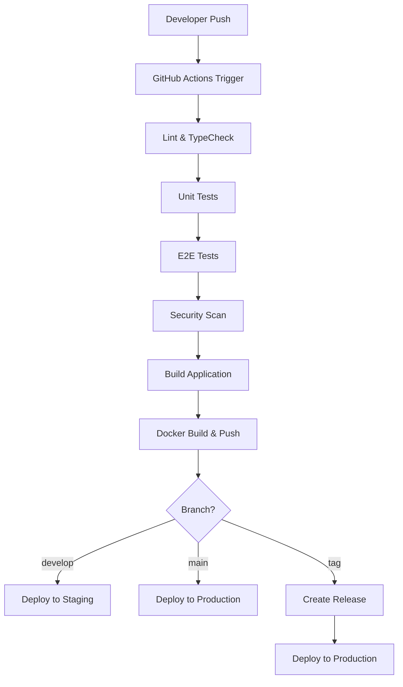

# CI/CD Pipeline Documentation

## Overview

This document describes the complete CI/CD pipeline setup for the Knowledge RAG Web UI project. The pipeline includes automated testing, security scanning, building, and deployment to staging and production environments.

## Pipeline Architecture



## Workflows

### 1. Main CI/CD Workflow (`.github/workflows/ci.yml`)

**Triggers:**
- Push to `master`, `main`, `develop` branches
- Pull requests to `master`, `main`
- Release events

**Jobs:**

#### Lint and Type Check
- ESLint with zero warnings tolerance
- TypeScript compilation check
- Fast feedback for code quality issues

#### Unit and Integration Tests
- Jest test runner with coverage reporting
- Coverage upload to Codecov
- Minimum coverage thresholds enforced

#### End-to-End Tests
- Playwright browser testing
- Multiple browser support (Chrome, Firefox, Safari)
- Test result artifacts on failure

#### Security Scanning
- npm audit for vulnerable dependencies
- CodeQL static analysis
- Security alerts and notifications

#### Build and Docker
- Production build compilation
- Bundle size analysis
- Multi-platform Docker images (AMD64, ARM64)
- Container registry push to GitHub Container Registry

#### Deployment
- **Staging**: Auto-deploy on `develop` branch
- **Production**: Auto-deploy on `main` branch or release tags
- Environment-specific configurations
- Health checks and rollback capabilities

### 2. Release Workflow (`.github/workflows/release.yml`)

**Triggers:**
- Git tags matching `v*` pattern

**Features:**
- Automated changelog generation
- Release artifact creation (tar.gz, zip)
- GitHub release creation
- Production deployment
- Docker image tagging and distribution

### 3. Dependency Updates (`.github/workflows/dependency-updates.yml`)

**Schedule:** Weekly (Mondays at 9 AM UTC)

**Features:**
- Automated dependency updates using npm-check-updates
- Security vulnerability scanning
- Automated PR creation with test results
- Dependencies grouped by update type

### 4. Performance Monitoring (`.github/workflows/performance.yml`)

**Schedule:** Daily (2 AM UTC)

**Features:**
- Lighthouse CI performance audits
- Bundle size analysis and tracking
- Performance regression detection
- Automated performance reports

## Environment Configuration

### Staging Environment

**Purpose:** Integration testing and feature validation

**Configuration:**
- Single replica deployment
- Reduced resource allocation
- Development-friendly settings
- Automatic deployment from `develop` branch

**Access:** `https://staging.knowledge-rag.example.com`

### Production Environment

**Purpose:** Live application serving end users

**Configuration:**
- Multi-replica deployment (3-10 pods)
- Horizontal Pod Autoscaling (HPA)
- Production-optimized settings
- Manual deployment approval required

**Access:** `https://knowledge-rag.example.com`

## Security Measures

### Container Security
- Non-root user execution
- Read-only root filesystem
- Minimal attack surface
- Regular base image updates

### Secrets Management
- GitHub Secrets for sensitive data
- Kubernetes Secrets for runtime configuration
- No hardcoded credentials in code
- Automatic secret rotation capabilities

### Network Security
- Network policies for pod-to-pod communication
- TLS termination at ingress
- CORS configuration
- Rate limiting and DDoS protection

### Vulnerability Management
- Automated dependency scanning
- Container image vulnerability scanning
- Security advisory notifications
- Immediate patching workflows

## Monitoring and Observability

### Application Metrics
- Prometheus metrics collection
- Grafana dashboards
- Custom application metrics
- SLA/SLO monitoring

### Logging
- Centralized logging with ELK stack
- Structured JSON logging
- Log aggregation and analysis
- Error tracking and alerting

### Performance Monitoring
- Real User Monitoring (RUM)
- Synthetic monitoring
- Core Web Vitals tracking
- Performance budgets

### Health Checks
- Kubernetes liveness probes
- Readiness probes
- Deep health checks
- Dependency health monitoring

## Deployment Scripts

### Environment Setup
```bash
# Setup staging environment
./scripts/deployment/setup-environment.sh staging

# Setup production environment
./scripts/deployment/setup-environment.sh production
```

### Manual Deployment
```bash
# Deploy to staging
./scripts/deployment/deploy.sh staging v1.2.3

# Deploy to production
./scripts/deployment/deploy.sh production v1.2.3
```

### Rollback
```bash
# Rollback to previous version
./scripts/deployment/rollback.sh production

# Rollback to specific revision
./scripts/deployment/rollback.sh production 5
```

## Configuration Management

### Environment Variables

#### Development
```bash
NODE_ENV=development
VITE_API_BASE_URL=http://localhost:8002
VITE_KNOWLEDGE_GRAPH_URL=http://localhost:8001
VITE_VECTOR_DB_URL=http://localhost:8003
VITE_UNIFIED_DB_URL=http://localhost:8004
```

#### Staging
```bash
NODE_ENV=staging
VITE_API_BASE_URL=https://staging-api.knowledge-rag.example.com
VITE_KNOWLEDGE_GRAPH_URL=https://staging-graph.knowledge-rag.example.com
VITE_VECTOR_DB_URL=https://staging-vector.knowledge-rag.example.com
VITE_UNIFIED_DB_URL=https://staging-db.knowledge-rag.example.com
```

#### Production
```bash
NODE_ENV=production
VITE_API_BASE_URL=https://api.knowledge-rag.example.com
VITE_KNOWLEDGE_GRAPH_URL=https://graph.knowledge-rag.example.com
VITE_VECTOR_DB_URL=https://vector.knowledge-rag.example.com
VITE_UNIFIED_DB_URL=https://db.knowledge-rag.example.com
```

## Quality Gates

### Code Quality
- ESLint: 0 errors, 0 warnings
- TypeScript: Strict compilation
- Test coverage: >80%
- Performance budget: <200KB gzipped

### Security Requirements
- No high/critical vulnerabilities
- All dependencies up to date
- Security headers configured
- Authentication/authorization working

### Performance Benchmarks
- Lighthouse Performance: >90
- First Contentful Paint: <2s
- Largest Contentful Paint: <3s
- Cumulative Layout Shift: <0.1

## Troubleshooting

### Common Issues

#### Pipeline Failures
1. **Lint errors**: Fix ESLint issues in code
2. **Test failures**: Review test logs, fix failing tests
3. **Build failures**: Check TypeScript errors, dependencies
4. **Deployment failures**: Verify Kubernetes resources, secrets

#### Performance Issues
1. **Slow builds**: Optimize dependencies, use build caching
2. **Large bundle size**: Analyze bundle, implement code splitting
3. **Poor Lighthouse scores**: Optimize images, reduce JavaScript

#### Security Alerts
1. **Vulnerability scan failures**: Update dependencies
2. **Container scan issues**: Update base images
3. **Secret leaks**: Rotate secrets, review code

### Debug Commands

```bash
# Check deployment status
kubectl get deployments -n production

# View pod logs
kubectl logs -f deployment/knowledge-rag-webui -n production

# Check service health
kubectl get svc,ingress -n production

# Review recent events
kubectl get events -n production --sort-by='.lastTimestamp'

# Debug pod issues
kubectl describe pod <pod-name> -n production
```

## Maintenance

### Regular Tasks

#### Daily
- Monitor application performance
- Review error logs and alerts
- Check security scan results

#### Weekly
- Review dependency updates
- Analyze performance trends
- Update documentation

#### Monthly
- Review and update security policies
- Performance optimization review
- Disaster recovery testing

### Backup and Recovery

#### Database Backups
- Automated daily backups
- Point-in-time recovery capability
- Cross-region backup replication

#### Configuration Backups
- Kubernetes manifests in Git
- Environment variable backups
- Certificate and secret backups

#### Disaster Recovery
- Multi-region deployment capability
- Automated failover procedures
- Recovery time objective: <30 minutes
- Recovery point objective: <1 hour

## Team Responsibilities

### Developers
- Write quality code with tests
- Follow security best practices
- Monitor pipeline results
- Fix failing builds promptly

### DevOps Engineers
- Maintain CI/CD infrastructure
- Monitor system performance
- Handle deployments and rollbacks
- Manage secrets and configurations

### Security Team
- Review security scan results
- Manage vulnerability remediation
- Update security policies
- Conduct security audits

## Future Improvements

### Planned Enhancements
- Blue-green deployment strategy
- Canary releases with traffic splitting
- Advanced monitoring and alerting
- Multi-cloud deployment capability
- Infrastructure as Code with Terraform

### Automation Goals
- Zero-downtime deployments
- Automated security patching
- Self-healing infrastructure
- Predictive scaling based on usage patterns

## Support and Contact

For CI/CD pipeline issues or questions:
- **Primary Contact**: DevOps Team
- **Emergency Contact**: On-call Engineer
- **Documentation**: [Internal Wiki]
- **Issue Tracking**: GitHub Issues

---

*Last Updated: 2025-06-22*
*Version: 1.0*